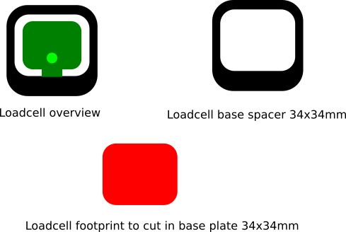
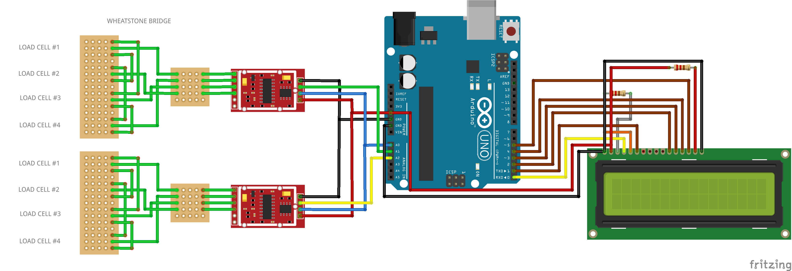

# drinkscaler

Load cell capacity 50 kg each, 200 kg in total (4x)
HEX711 AD converter

Loadcell footprint to be cut into a wood/acrylic plate using cnc/dremel/laser.

# Fritzing wiring diagram

# BOM prototype

1x Arduino Uno (preferably FTDI usb chip, but CH340 is 'ok')

1x LCD shield [1602](https://www.aliexpress.com/item/32334900048.html?spm=a2g0o.productlist.0.0.1cc757bfgpq7me&algo_pvid=9c5c1325-0db9-4f84-8b9b-8c8d6a4fd1e9&algo_expid=9c5c1325-0db9-4f84-8b9b-8c8d6a4fd1e9-9&btsid=d2308039-5851-4a75-81b8-714fc4c28788&ws_ab_test=searchweb0_0%2Csearchweb201602_5%2Csearchweb201603_55)

2x [4x load cell + hx711](https://www.aliexpress.com/item/32981802410.html?spm=a2g0s.9042311.0.0.27424c4dcAwWqs)

1x [1602 Display](https://www.dx.com/p/16-x-2-character-lcd-display-module-with-blue-backlight-2013778#.XTv7mJP7TBI)

1x [Prototype shield](https://www.ebay.com/itm/Prototype-Screw-Shield-Board-Kit-Arduino-UNO-R3-2-54mm-Mini-Terminal-Block-/191399694481?ef_id=CjwKCAjw7O_pBRA3EiwA_lmtfhlYqDaJ3_tEGVa5Q3yl_QX9KyYBRGa-oc95scV17OnwxOxEGQlQdhoCR54QAvD_BwE:G:s) maybe

2x resistors random value for LCD
A bunch of small single strand wires

# References

[bridge connection of load cells](https://www.tindie.com/products/lpaseen/load-cell-bridge-for-hx711-pcb-only/)

[load cell usage](https://www.youtube.com/watch?v=S12Mp8gDJmI)

[hx711](https://electronics.stackexchange.com/questions/278035/has-anyone-worked-with-hx711-load-cell-amplifier-weighting-sensor-through-ardu)

[scale](https://www.instructables.com/id/Arduino-Bathroom-Scale-With-50-Kg-Load-Cells-and-H/)